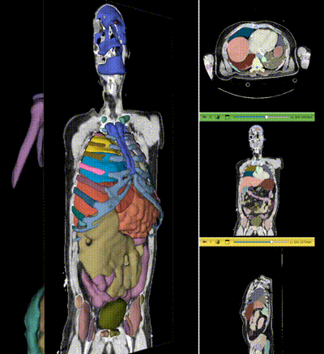
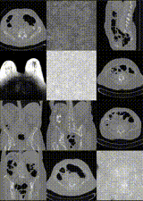
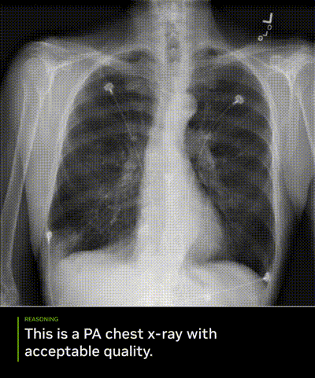

# **🧠 NVIDIA MedTech · Open Models Hub**

Physical AI for MedTech is here — where intelligent systems sense, perceive, and act in real time. Devices are born in simulation, learn new skills with [Isaac for Healthcare](https://github.com/isaac-for-healthcare), and deploy on [NVIDIA Holoscan](https://github.com/nvidia-holoscan/holoscan-sdk) for multi-sensor, multi-modal applications at the edge.

This organization is the home of Clara Medical Models — open foundation models to segment, reason, and generate across medical data. Built with [MONAI](https://github.com/Project-MONAI/MONAI), an NVIDIA co-founded open source toolkit for Medical AI research & development.

## **🚀 What’s inside**

### **Clara Medical Open Models**

| | | |
|:-:|:-:|:-:|
| **NV-Segment** | **NV-Generate** | **NV-Reason** |
| [GitHub](https://github.com/NVIDIA-Medtech/NV-Segment-CTMR) • [HF-CT](https://huggingface.co/nvidia/NV-Segment-CT) • [HF-CTMR](https://huggingface.co/nvidia/NV-Segment-CTMR) | [GitHub](https://github.com/NVIDIA-Medtech/NV-Generate-CTMR) • [HF-CT](https://huggingface.co/nvidia/NV-Generate-CT) • [HF-MR](https://huggingface.co/nvidia/NV-Generate-MR) | [GitHub](https://github.com/NVIDIA-Medtech/NV-Reason-CXR) • [HuggingFace](https://huggingface.co/nvidia/NV-Reason-CXR-3B) |
|  |  |  |
| Segments anything in 3D CT & MR volumetric images across 345+ anatomical structures through automatic detection & interactive point-click refinement workflows. | Generates high-resolution synthetic 3D CT & MR volumetric images with anatomical annotations to augment medical datasets while preserving patient privacy. | A vision-language model that uses chain-of-thought reasoning to express medical thinking step-by-step, based on how radiologists analyze chest X-rays. Designed to advance explainable AI research and bring transparency to Medical AI. |
