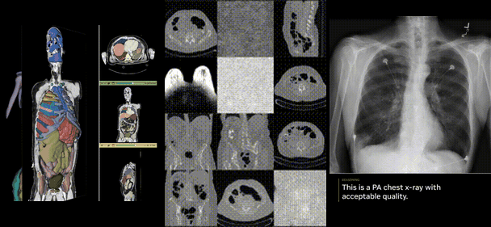

# NVIDIA MedTech

Open foundation models for physical AI and medical imaging.

- **11 models** for physical AI, segmentation, generation, and reasoning
- **5 modalities**: surgical video, CT, MRI, X-ray, and ultrasound
- Apache 2.0 source code. Model weights available on [HuggingFace](https://huggingface.co/collections/nvidia/medtech-open-models)

We have also released **[Open-H](https://github.com/open-h/data-collection)** — a community-wide initiative for physical AI datasets for healthcare robotics. Browse the dataset on [HuggingFace](https://huggingface.co/datasets/nvidia/PhysicalAI-Robotics-Open-H-Embodiment).

---

## Physical AI

Physical AI for surgical simulation and embodied robot control — built on [NVIDIA Cosmos](https://www.nvidia.com/en-us/ai/cosmos/) and [Isaac](https://developer.nvidia.com/isaac), deploys on [Holoscan](https://developer.nvidia.com/holoscan-sdk).

- **GR00T-H** — Healthcare variant of GR00T-N, post-trained for multi-embodiment surgical robot control across 16 platforms
- **Cosmos-H-Surgical** — Surgical video world model: Predict (future-state generation) and Transfer (control-conditioned generation)
- **Cosmos-H-Surgical-Simulator** — Action-conditioned video generation for in-silico policy evaluation across 9 surgical robot embodiments

| Model | Task | Modality | License | Links |
|-------|------|----------|---------|-------|
| **GR00T-H** | Surgical robot VLA | Multi | Non-Commercial | [Repo](https://github.com/NVIDIA-Medtech/GR00T-H) · [HF](https://huggingface.co/nvidia/GR00T-H) |
| **Cosmos-H-Surgical** | Surgical world model | Video | Non-Commercial | [Repo](https://github.com/NVIDIA-Medtech/Cosmos-H-Surgical) · [HF](https://huggingface.co/nvidia/Cosmos-H-Surgical) · [Paper](https://arxiv.org/abs/2512.23162) |
| **Cosmos-H-Surgical-Sim** | Action-conditioned sim | Video | Commercial | [Repo](https://github.com/NVIDIA-Medtech/Cosmos-H-Surgical-Simulator) · [HF](https://huggingface.co/nvidia/Cosmos-H-Surgical-Simulator) |

---

## Medical Imaging

Foundation models for 3D segmentation, synthetic volume generation, signal reconstruction, and clinical reasoning covering CT, MRI, X-ray, and ultrasound.

### Perception

- **NV-Segment-CT** — Segment with Automatic and interactive (point-click) methods for 132 anatomical structures in CT
- **NV-Segment-CTMR** — Segment 345+ classes across CT body, MRI body, and MRI brain
- **NV-Raw2Insights-MRI** — Transforms raw k-space signals to high-quality MRI with accelerated reconstruction and motion correction
- **NV-Raw2Insights-US** — Transforms raw ultrasound measurements to clinical-quality images using physics-informed AI

### Generation

- **NV-Generate-CT** — Paired CT images and segmentation masks up to 512x512x768
- **NV-Generate-MR** — Rectified Flow across brain, abdomen, breast, and prostate MRI
- **NV-Generate-MR-Brain** — Brain volumes across T1w, T2w, FLAIR, and SWI contrasts with cross-sequence synthesis via ControlNet
- [Live demo](https://build.nvidia.com/nvidia/maisi)

### Reasoning

- **NV-Reason-CXR** — 3B-parameter reasoning VLM built on Qwen2.5-VL that utilizes chain-of-thought reasoning for chest X-rays.
- [Live demo](https://huggingface.co/spaces/nvidia/nv-reason-cxr)

| Model | Task | Modality | License | Links |
|-------|------|----------|---------|-------|
| **NV-Segment-CT** | 132-class segmentation | CT | Commercial | [Repo](https://github.com/NVIDIA-Medtech/NV-Segment-CTMR) · [HF](https://huggingface.co/nvidia/NV-Segment-CT) · [Paper](https://arxiv.org/abs/2406.05285) |
| **NV-Segment-CTMR** | 345+ class segmentation | CT, MRI | Non-Commercial | [Repo](https://github.com/NVIDIA-Medtech/NV-Segment-CTMR) · [HF](https://huggingface.co/nvidia/NV-Segment-CTMR) · [Paper](https://arxiv.org/abs/2406.05285) |
| **NV-Raw2Insights-MRI** | Signal reconstruction | MRI | Commercial | [Repo](https://github.com/NVIDIA-Medtech/NV-Raw2insights-MRI) · [HF](https://huggingface.co/nvidia/NV-Raw2Insights-MRI) |
| **NV-Raw2Insights-US** | Signal reconstruction | Ultrasound | Non-Commercial | [Repo](https://github.com/NVIDIA-Medtech/NV-Raw2insights-US) · [HF](https://huggingface.co/nvidia/NV-Raw2Insights-US) |
| **NV-Generate-CT** | 3D volume synthesis | CT | Commercial | [Repo](https://github.com/NVIDIA-Medtech/NV-Generate-CTMR) · [HF](https://huggingface.co/nvidia/NV-Generate-CT) · [Paper](https://arxiv.org/abs/2508.05772) |
| **NV-Generate-MR** | 3D volume synthesis | MRI | Non-Commercial | [Repo](https://github.com/NVIDIA-Medtech/NV-Generate-CTMR) · [HF](https://huggingface.co/nvidia/NV-Generate-MR) · [Paper](https://arxiv.org/abs/2508.05772) |
| **NV-Generate-MR-Brain** | Brain MRI synthesis | MRI | Commercial | [Repo](https://github.com/NVIDIA-Medtech/NV-Generate-CTMR) · [HF](https://huggingface.co/nvidia/NV-Generate-MR-Brain) · [Paper](https://arxiv.org/abs/2508.05772) |
| **NV-Reason-CXR** | Chest X-ray reasoning | X-Ray | Non-Commercial | [Repo](https://github.com/NVIDIA-Medtech/NV-Reason-CXR) · [HF](https://huggingface.co/nvidia/NV-Reason-CXR-3B) · [Paper](https://arxiv.org/abs/2510.23968) |

---

## Licensing

Models are released under the [NVIDIA Open Model License](https://www.nvidia.com/en-us/agreements/enterprise-software/nvidia-open-model-license/) (commercial) or [NVIDIA Non-Commercial License](https://developer.download.nvidia.com/licenses/NVIDIA-OneWay-Noncommercial-License-22Mar2022.pdf). Source code is Apache 2.0. Check each model's repository for the specific license terms.
